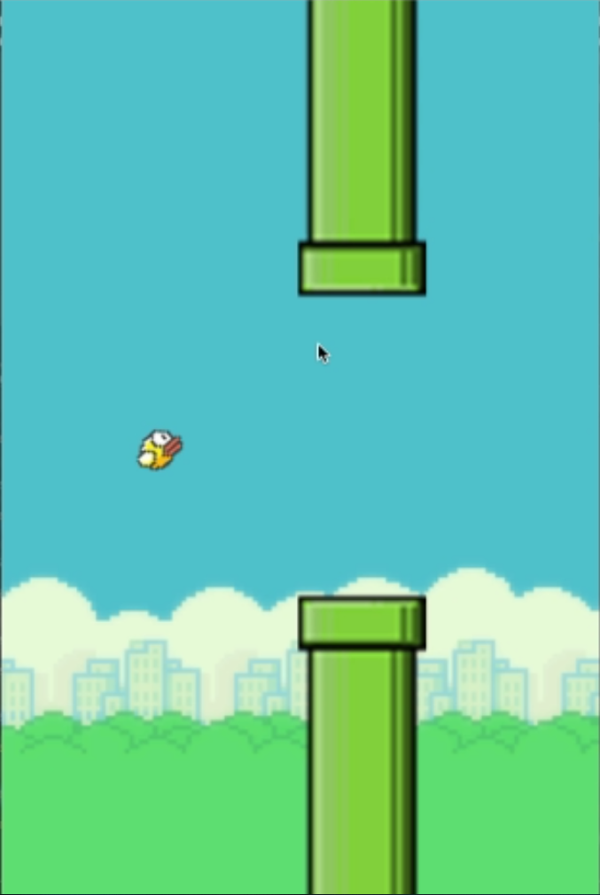
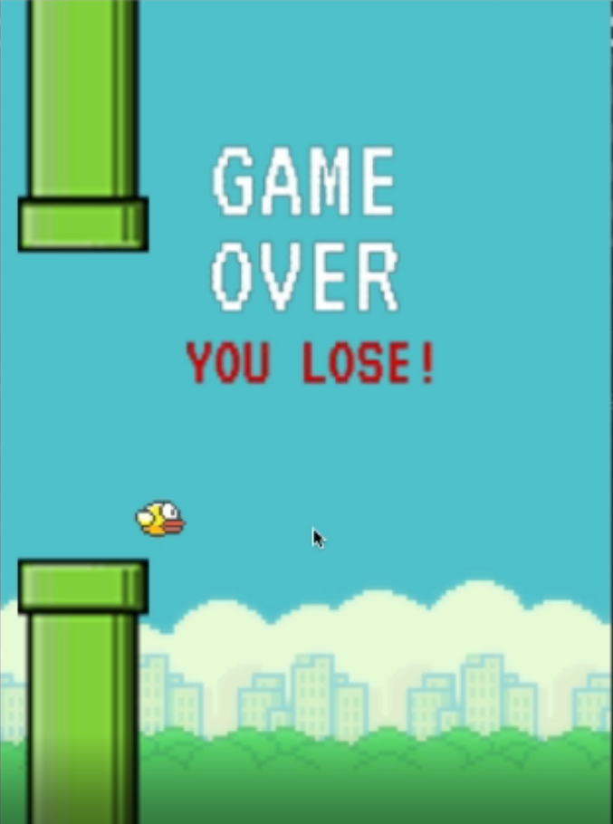
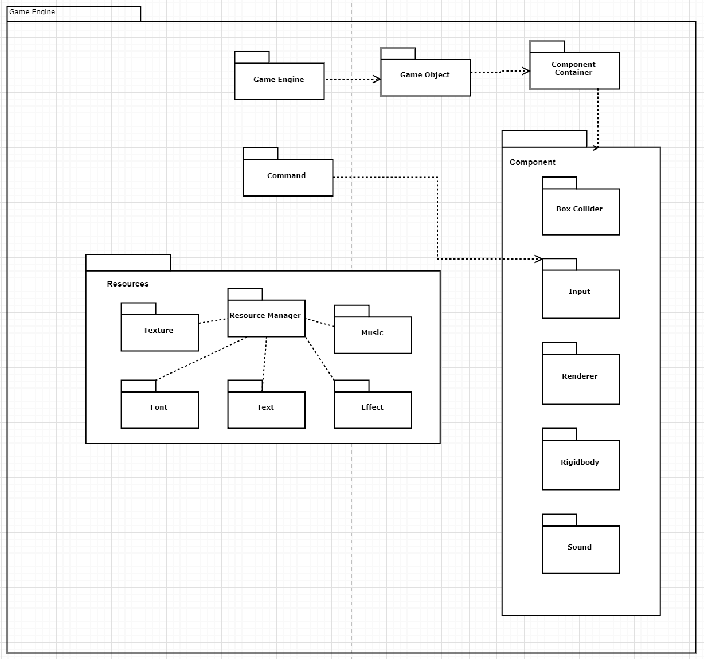

# FlappyBirdie by AR^3

## Download

[Click here to download!](https://www.dropbox.com/s/c88zcqvgntmpl1j/twengine.zip?dl=0)

## Documentation
[Click here for documentation](Docs/html/index.html)

## Gameplay Trailer

<iframe width="560" height="315" src="https://www.youtube.com/embed/7tm-ZwSEddg" frameborder="0" allow="accelerometer; autoplay; encrypted-media; gyroscope; picture-in-picture" allowfullscreen></iframe>

## Screenshots

## Engine Post Mortem
Looking back, we are proud of how we built our engine, implementing many patterns. We implemented component based gameobjects, used a component messaging system, included a singleton gameengine and resource manager, alongside a command pattern for keymapping. We aimed to be abstract and concise, and looking forward we could have definitely included more object oriented patterns such as a builder or factory pattern for our gameobject construction and component construction. We used our resource manager extensively throughout as it was a great way of linking instantiated pointers from across the engine with ease. Alongside loading all assets we may need, it was probably the most useful way of storing and retrieving data. Looking back at our MVP proposal, we've hit all our goals and even got to include our "Would be cool to have" goal of scripting through our pybind components.

Pybind was incredibly powerful in allowing us to abstract our game engine into being editable from a python script. Using pybind we can instantiate gameobjects and add components manually. We even found out we can extend our abstract component class to implement our own components from pybind, which effectively allows the user to code whatever functionality they want within this component's update function. In the bigger picture, the ability to add custom components and implement them however we want has allowed for user scripting within our engine. This was a big revelation for the team.

If we had more time we would have liked to add a layering system for rendering. Currently all gameobjects will render in the order they happen to be in the gameobjects vector in the engine. This means the last one rendered is the one layered on top of each previous one. We would want to be able to control what layer something renders at to give the user flexibility without having to worry about insertion order in the gameobjects vector.

### Team AR^3
- Ryan Teng
- Roger Chen
- Andrew Alcala
- Raymond Namar
